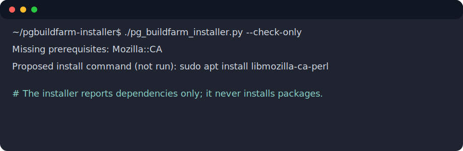
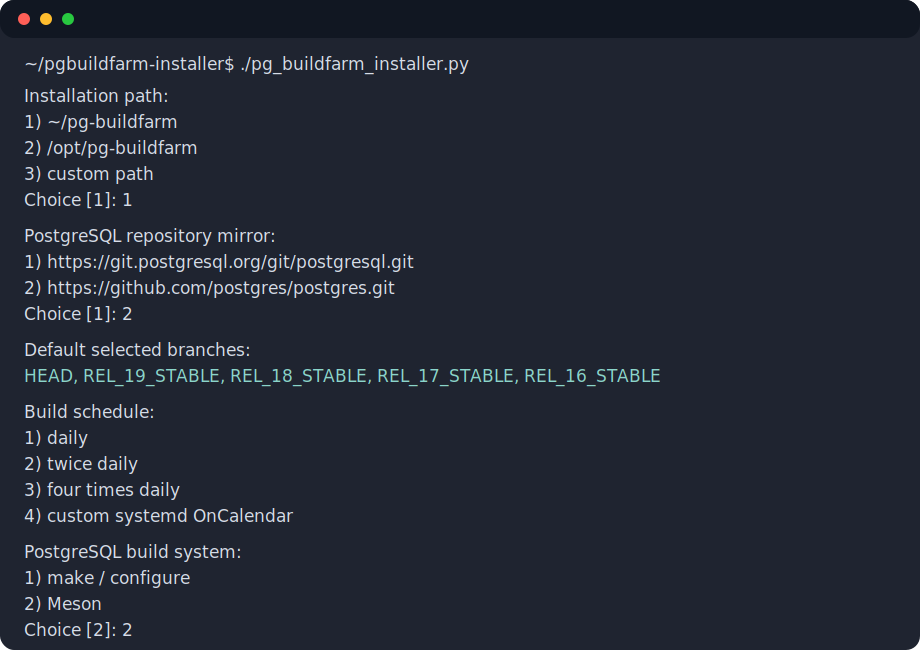
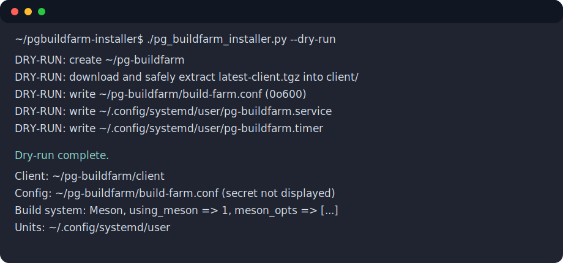

# PostgreSQL Buildfarm Installer

[](#requirements)
[](https://github.com/sxd/pgbuildfarm-installer/actions/workflows/tests.yml)
[](LICENSE)

Self-contained Python installer for configuring a PostgreSQL Buildfarm client
animal under the current user.

The installer follows the PostgreSQL Buildfarm setup flow and deliberately uses
user-level systemd units only. It never installs packages automatically and it
never configures the buildfarm runtime as root.

## Requirements

- Python 3.12 or newer
- Linux with user-level systemd
- Perl and PostgreSQL build dependencies
- Git
- Meson and Ninja/Samurai if you select the Meson build system

Run the preflight check first:

```sh
python3 pg_buildfarm_installer.py --check-only
```

If dependencies are missing, the script prints a proposed package-manager
command and exits. It does not run that command for you.

## Download and run

Download the single-file installer:

```sh
curl -fsSLO https://raw.githubusercontent.com/sxd/pgbuildfarm-installer/main/pg_buildfarm_installer.py
chmod +x pg_buildfarm_installer.py
./pg_buildfarm_installer.py --check-only
./pg_buildfarm_installer.py
```

Or clone this repository:

```sh
git clone https://github.com/sxd/pgbuildfarm-installer.git
cd pgbuildfarm-installer
./pg_buildfarm_installer.py --check-only
./pg_buildfarm_installer.py
```

Use `--dry-run` to inspect planned actions without writing files:

```sh
./pg_buildfarm_installer.py --dry-run
```

## Testing

The `Tests` workflow runs the default offline test suite:

```sh
python3 -m pytest -m "not network and not slow"
```

The workflow does not run network-marked or slow tests by default.

## Resuming after failures

The installer saves non-secret wizard answers as they are entered, so if a later step
fails you can rerun the script without retyping everything. If an answer is
already present in the answers file, the installer does not ask that question
again.

Default saved-answer file:

```text
$TEMP/pg-buildfarm-answers.json
```

If `TEMP` is not set, Python's temporary-directory default is used. The file is
written with mode `0600`. The buildfarm secret is not persisted to this file.

Use a specific answer file:

```sh
./pg_buildfarm_installer.py --answers-file ./my-builder-answers.json
```

The file can either use the installer's saved format:

```json
{
  "version": 1,
  "answers": {
    "path_choice": "1",
    "client_source": "1",
    "remote_choice": "1",
    "mirror_mode": "1",
    "branch_choice": "1",
    "schedule": "2",
    "animal": "myanimal",
    "build_system_choice": "2",
    "meson_preset": "1",
    "meson_jobs": "",
    "meson_test_timeout": "3",
    "extra_path": ""
  }
}
```

or a flat JSON object with the same answer keys:

```json
{
  "path_choice": "1",
  "client_source": "1",
  "remote_choice": "1",
  "mirror_mode": "1",
  "branch_choice": "1",
  "schedule": "2",
  "animal": "myanimal",
  "build_system_choice": "2",
  "meson_preset": "1",
  "meson_jobs": "",
  "meson_test_timeout": "3",
  "extra_path": ""
}
```

Ignore saved answers for one run:

```sh
./pg_buildfarm_installer.py --reset-answers
```

## What it configures

The wizard asks for:

- install directory:
  - `~/pg-buildfarm`
  - `/opt/pg-buildfarm`
  - custom path
- Buildfarm client source:
  - download `latest-client.tgz`
  - clone `https://github.com/PGBuildFarm/client-code`
- PostgreSQL source mirror:
  - `https://git.postgresql.org/git/postgresql.git`
  - `https://github.com/postgres/postgres.git`
- mirror mode:
  - buildfarm-managed mirror
  - user-maintained local bare mirror
- branch list
- schedule
- animal name and secret
- PostgreSQL build system:
  - make / configure
  - Meson
- build options preset or custom options
- optional build `PATH` prefix

The installer suggests two option presets for each build system:

| Build system | Preset | Options |
| --- | --- | --- |
| make / configure | common hacker/assertion build | `--enable-cassert --enable-debug --enable-tap-tests` |
| make / configure | feature buildfarm-style build | `--enable-cassert --enable-debug --enable-nls --enable-tap-tests --with-perl --with-python --with-tcl --with-openssl --with-icu --with-libxml --with-libxslt` |
| Meson | common hacker/assertion build | `-Dcassert=true -Ddebug=true -Dtap_tests=enabled` |
| Meson | feature buildfarm-style build | `-Dcassert=true -Ddebug=true -Dtap_tests=enabled -Dnls=enabled -Dplperl=enabled -Dplpython=enabled -Dpltcl=enabled -Dssl=openssl -Dicu=enabled -Dlibxml=enabled -Dlibxslt=enabled -Dzlib=enabled -Dreadline=enabled` |

When Meson is selected, the generated `build-farm.conf` uses Buildfarm's
`using_meson` and `meson_opts` settings. When make is selected, it uses
`config_opts`. The generated file keeps only the selected build system's option
array:

```perl
my @meson_opts = (...);   # Meson installs
my @config_opts = (...);  # make / configure installs
```

Additional Linux testing options, branch-specific options, `CPPFLAGS`, and
`PG_TEST_EXTRA` examples are included as commented lines in the generated
configuration so users can opt in after installing the needed dependencies.

Default branches:

```text
HEAD
REL_19_STABLE
REL_18_STABLE
REL_17_STABLE
REL_16_STABLE
```

Default schedule:

```text
twice daily
```

The generated service starts in commissioning mode:

```sh
run_branches.pl --run-all --nosend --nostatus --verbose --config <build-farm.conf>
```

Remove `--nosend --nostatus` only after the animal is registered and local
commissioning runs are clean.

## Generated files

By default:

```text
~/pg-buildfarm/
├── build-farm.conf
├── builds/
├── client/
└── postgresql.git        # only for user-maintained local mirror mode

~/.config/systemd/user/
├── pg-buildfarm.service
├── pg-buildfarm.timer
├── pg-buildfarm-mirror-update.service   # local mirror mode only
└── pg-buildfarm-mirror-update.timer     # local mirror mode only
```

The config file is written with mode `0600`. The secret is not printed in the
summary or logs produced by the installer.

## Validate the commissioning run

Before enabling the timer or sending results, run the commissioning command
manually:

```sh
cd ~/pg-buildfarm/client
./run_branches.pl --run-all --nosend --nostatus --verbose --config ~/pg-buildfarm/build-farm.conf
```

It is validated when the command exits successfully:

```sh
echo $?
```

Expected result:

```text
0
```

If it fails, inspect the terminal output, fix the reported dependency or
configuration problem, and rerun the same command.

If validation fails with:

```text
error getting branches of interest: 400 URL missing
```

check that `build-farm.conf` contains the Buildfarm status target:

```perl
target => 'https://buildfarm.postgresql.org/cgi-bin/pgstatus.pl',
```

The client uses that URL to locate `branches_of_interest.json` for
`run_branches.pl`.

If a Meson validation run fails with:

```text
Can't use an undefined value as a HASH reference at ./run_build.pl line ...
```

check that `build-farm.conf` contains an explicit configure environment hash:

```perl
config_env => {},
```

The buildfarm client's Meson setup path clones `config_env`; leaving it
undefined can fail before `meson setup` starts.

## Register the animal and add credentials

1. Validate locally first using the no-send command above.
2. Register the animal with the PostgreSQL Buildfarm:

   ```text
   https://buildfarm.postgresql.org/cgi-bin/register-form.pl
   ```

   The installer prints the system details needed by the registration form:

   ```text
   Operating System
   OS Version
   Compiler
   Compiler Version
   Architecture
   ```

   If the selected compiler command is a generic driver such as `cc`, the
   installer identifies GCC or Clang from predefined compiler macros and prints
   it as, for example, `gcc (via cc)` or `clang (via cc)`.

3. After the animal is approved, edit the generated config:

   ```sh
   chmod 600 ~/pg-buildfarm/build-farm.conf
   ${EDITOR:-vi} ~/pg-buildfarm/build-farm.conf
   ```

4. Set the approved values:

   ```perl
   animal => 'your-animal-name',
   secret => 'your-buildfarm-secret',
   ```

5. Run one more no-send validation:

   ```sh
   cd ~/pg-buildfarm/client
   ./run_branches.pl --run-all --nosend --nostatus --verbose --config ~/pg-buildfarm/build-farm.conf
   echo $?
   ```

6. If it exits with `0`, remove `--nosend --nostatus` from the generated user
   service:

   ```sh
   ${EDITOR:-vi} ~/.config/systemd/user/pg-buildfarm.service
   systemctl --user daemon-reload
   ```

## Enable the timer

After validation succeeds:

```sh
systemctl --user daemon-reload
systemctl --user enable --now pg-buildfarm.timer
systemctl --user status pg-buildfarm.timer
```

For user-maintained local mirror mode:

```sh
systemctl --user enable --now pg-buildfarm-mirror-update.timer
```

Inspect logs with:

```sh
journalctl --user -u pg-buildfarm.service
systemctl --user show pg-buildfarm.service -p ExecMainStatus -p Result
```

## Screenshot examples

Preflight dependency report:



Interactive choices:



Dry-run summary:



## License

Apache License 2.0. See [LICENSE](LICENSE).
